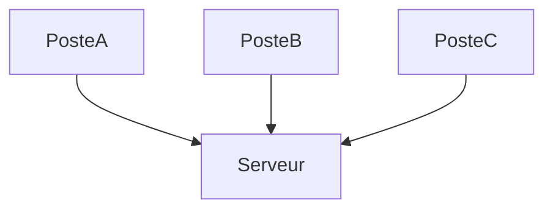

## Question 1 : Dans mon entreprise...

##### - Les groupes (dév/ops/produit/sécurité)
```
Dans mon alternance, mon équipe est composé de deux développeurs, et les produits que nous conçevons sont réservé à un usage strict de nôtre entreprise.
```

#### Les pratiques DevOps
```
Il n'y en à pas énormément, étant composé de peux de personnes, dont mon tuteur qui appris le métier en autodidacte, il n'utilise qu'un serveur contenant l'exe des applications métiers, ce qui lui sert à mêtre une application en production.
```

#### Le schéma d'architecture globale


```
Toutes les applications sont téléchargement localement sur les postes, et à chaque démarage du portail, la version des apps est récupéré et si une nouvelle est trouvée, elle est téléchargé depuis le serveur.

Le portail est une application servant d'authentification & permettant de lancer toutes les autres
```

#### Le processus de build, de déploiement et de release
```
Mon N+1 va me donner des instructions sur une application à réaliser, que je vais mettre au papier, lorsque les demandes sont réalisés, je lui passe mon disque dur contenant le projet Windev, puis il va les importé de son cotés, vérifié que tout est bon puis à terme le mettre en production.
```

#### Les moyens mis en oeuvre pour tester
```
Le débuggeur Windev (IDE)
```

#### Identifiez les points de blocages et les bons plans
```
Les méthodes utilisés ne sont clairement optimales mais font le travail dans nôtre cas, lorsqu'il y à un problème il retourne l'application en erreur dans un version antérieur.
```

#### Identifiez les outils utilisés
```
Seul Windev, notre IDE est utilisé, Github ne l'est pas ce qui serait déjà un grand plus.
```